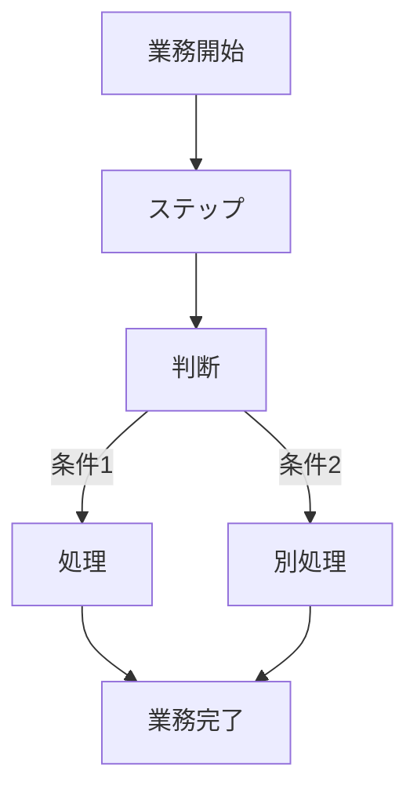

> **参照元（入力資料）:**
> - 業務要件一覧.md（業務要件ID・業務種別の特定）
> - 業務一覧.md（業務ID・業務名の特定）
> - 役割分担定義.md（実行主体・責務分担の決定）
> - 業務ルール定義_判断基準定義.md（判断・ルールとの紐付け）

## 業務プロセス定義

### 基本情報
- 業務ID：
- 業務名：
- 業務目的：
- 対象ユーザ：
- 開始条件（トリガー）：
- 終了条件：

### 業務フロー（To-Be）

## 業務ステップ定義：ST-XX

### 1) 基本情報
- ステップID：
- ステップ名：
- 対応業務ID：
- 対応プロセスID：
- ステップ種別：
- 実行主体：
  - ☐ 人
  - ☐ AIエージェント
  - ☐ 人＋AI（協調）

### 2) ステップ概要
- 目的：
- このステップで達成すること：
- 業務上の意味：

### 3) フロー上の位置

- 直前ステップ：
- 直後ステップ（通常）：
- 分岐先ステップ（条件付き）：

### 4) 入力情報

| データID | データ名 | 取得元 | 必須 | 欠落時対応 |
|---|---|---|---:|---|
|  |  |  |  |  |

### 5) 実施内容

#### 5.1 処理概要
- 実施する業務処理：

#### 5.2 処理詳細（業務粒度）
1. 
2. 
3. 

### 6) 判断・ルール

| 種別 | ID | 利用方法 |
|---|---|---|
|  |  |  |

### 7) 出力結果

| データID | データ名 | 出力先 | 確定主体 |
|---|---|---|---|
|  |  |  |  |

### 8) 例外処理

| ケース | 発生条件 | 対応 | 遷移先 |
|---|---|---|---|
|  |  |  |  |

### 9) 責務分担

| 項目 | 人 | AIエージェント |
|---|---|---|
| 入力 |  |  |
| 判断 |  |  |
| 実行 |  |  |

### 10) 完了条件
- 正常終了条件：
- 未完了・中断条件：

### 例外処理

| ケース | 発生条件 | 対応方針 | 担当 |
|---|---|---|---|
|  |  |  |  |

