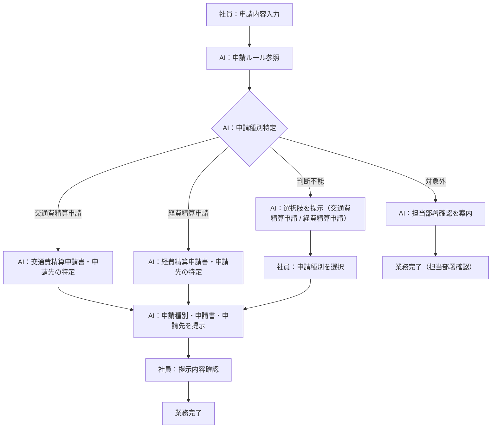
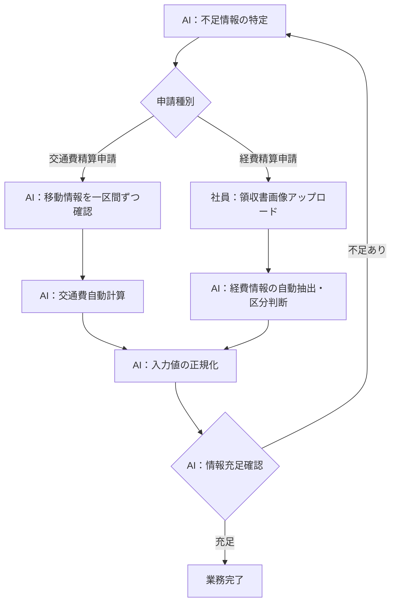
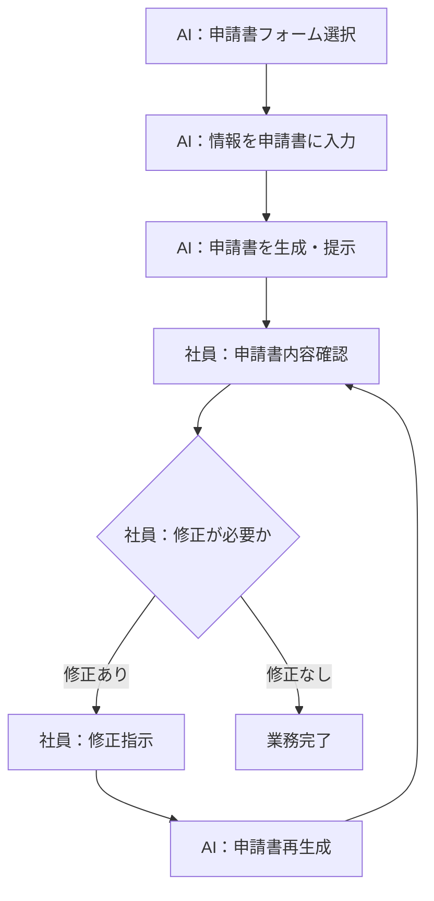
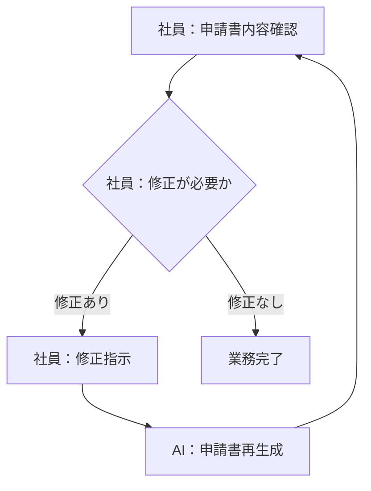

> **参照元（入力資料）:**
> - 業務要件一覧.md（業務要件ID・業務種別の特定）
> - 業務一覧.md（業務ID・業務名の特定）
> - 役割分担定義.md（実行主体・責務分担の決定）
> - 業務ルール定義_判断基準定義.md（判断・ルールとの紐付け）

## 業務プロセス定義

---

### 基本情報
- 業務ID：BZ-01
- 業務名：申請種別判断・案内
- 業務目的：社員の申請内容から必要な申請種別（交通費精算申請・経費精算申請）・申請書・申請先を判断して提示する
- 対象ユーザ：一般社員
- 開始条件（トリガー）：社員が申請したい内容（自然言語）を入力する
- 終了条件：社員が提示された申請種別・申請書・申請先を確認する

### 業務フロー（To-Be）

## 業務ステップ定義：ST-BZ01

### 1) 基本情報
- ステップID：ST-BZ01-01
- ステップ名：申請内容入力
- 対応業務ID：BZ-01
- 対応プロセスID：BZ-01
- ステップ種別：入力
- 実行主体：
  - ☑ 人
  - ☐ AIエージェント
  - ☐ 人＋AI（協調）

### 2) ステップ概要
- 目的：社員が申請したい内容を自然言語で入力する
- このステップで達成すること：AIが申請種別を判断するための入力情報の取得
- 業務上の意味：申請プロセスの起点となる情報収集

### 3) フロー上の位置

- 直前ステップ：なし（業務開始）
- 直後ステップ（通常）：ST-BZ01-02
- 分岐先ステップ（条件付き）：なし

### 4) 入力情報

| データID | データ名 | 取得元 | 必須 | 欠落時対応 |
|---|---|---|---:|---|
| D-001 | 申請内容テキスト | 社員入力 | 必須 | 再入力要求 |

### 5) 実施内容

#### 5.1 処理概要
- 実施する業務処理：社員がチャット画面に申請したい内容を自然言語で入力する

#### 5.2 処理詳細（業務粒度）
1. 社員が申請したい内容（例：「タクシー代を精算したい」「文房具を購入した領収書を精算したい」）を入力欄に入力する
2. 入力内容をAIエージェントへ送信する

### 6) 判断・ルール

| 種別 | ID | 利用方法 |
|---|---|---|
| なし | - | - |

### 7) 出力結果

| データID | データ名 | 出力先 | 確定主体 |
|---|---|---|---|
| D-001 | 申請内容テキスト | ST-BZ01-02 | 人 |

### 8) 例外処理

| ケース | 発生条件 | 対応 | 遷移先 |
|---|---|---|---|
| 空入力 | 入力欄が空のまま送信 | 再入力を促すメッセージを表示 | ST-BZ01-01 |

### 9) 責務分担

| 項目 | 人 | AIエージェント |
|---|---|---|
| 入力 | ○ | × |
| 判断 | × | × |
| 実行 | ○ | × |

### 10) 完了条件
- 正常終了条件：申請内容テキストが入力されAIに送信された
- 未完了・中断条件：入力欄が空のまま送信された

---

### 基本情報
- 業務ID：BZ-01
- 業務名：申請種別判断・案内（続き）
- ステップID：ST-BZ01-02

## 業務ステップ定義：ST-BZ01-02

### 1) 基本情報
- ステップID：ST-BZ01-02
- ステップ名：申請ルール参照・申請種別判断
- 対応業務ID：BZ-01
- 対応プロセスID：BZ-01
- ステップ種別：判断・実行
- 実行主体：
  - ☐ 人
  - ☑ AIエージェント
  - ☐ 人＋AI（協調）

### 2) ステップ概要
- 目的：社員の申請内容から申請種別（交通費精算申請・経費精算申請）を特定する
- このステップで達成すること：申請ルールに基づく申請種別の特定
- 業務上の意味：申請書・申請先の特定の前提となる判断処理

### 3) フロー上の位置

- 直前ステップ：ST-BZ01-01
- 直後ステップ（通常）：ST-BZ01-03
- 分岐先ステップ（条件付き）：ST-BZ01-04（判断不能時）、BRL-06（対象外→担当部署案内）

### 4) 入力情報

| データID | データ名 | 取得元 | 必須 | 欠落時対応 |
|---|---|---|---:|---|
| D-001 | 申請内容テキスト | ST-BZ01-01 | 必須 | ST-BZ01-01へ戻る |
| D-002 | 申請ルール情報 | ナレッジベース（社内申請ルール） | 必須 | エスカレーション |

### 5) 実施内容

#### 5.1 処理概要
- 実施する業務処理：申請ルールナレッジを参照して申請内容に対応する申請種別を特定する

#### 5.2 処理詳細（業務粒度）
1. 入力された申請内容テキストから申請目的・行動・購入物等を解析する
2. 社内申請ルールのナレッジベースを参照する
3. 解析結果と申請ルールを照合し、交通費精算申請・経費精算申請のいずれかに該当するか判断する
4. 判断できない場合はST-BZ01-04（申請種別確認）へ遷移する
5. 対象外の場合は担当部署確認を案内する

### 6) 判断・ルール

| 種別 | ID | 利用方法 |
|---|---|---|
| 業務ルール | BRL-01 | 申請内容から申請種別を特定する基準として使用 |
| 業務ルール | BRL-06 | 対象外時の案内方針として使用 |
| 業務ルール | BRL-07 | 判断困難時のエスカレーション基準として使用 |
| 業務ルール | BRL-08 | 判断不能時のユーザー確認方針として使用 |
| 判断基準 | JD-01 | 申請種別特定の判断基準として使用 |
| 判断基準 | JD-10 | 判断不能時の対応判断として使用 |

### 7) 出力結果

| データID | データ名 | 出力先 | 確定主体 |
|---|---|---|---|
| D-003 | 申請種別一覧 | ST-BZ01-03 | AI |
| D-004 | 判断根拠情報 | ST-BZ01-03 | AI |

### 8) 例外処理

| ケース | 発生条件 | 対応 | 遷移先 |
|---|---|---|---|
| 申請ルールナレッジ参照失敗 | ナレッジベースへのアクセス不可 | エラーを通知し担当部署確認を案内 | 業務完了（エラー通知） |
| 判断困難ケース | 申請ルールが不明確・矛盾 | BRL-07に従いエスカレーション案内 | 業務完了（エスカレーション） |
| 判断不能ケース | 交通費精算申請・経費精算申請のいずれかを判断できない | BRL-08に従い選択肢を提示 | ST-BZ01-04 |

### 9) 責務分担

| 項目 | 人 | AIエージェント |
|---|---|---|
| 入力 | × | ○ |
| 判断 | × | ○ |
| 実行 | × | ○ |

### 10) 完了条件
- 正常終了条件：申請種別が特定された
- 未完了・中断条件：申請ルールナレッジが参照不可、または判断困難なケースでエスカレーション

---

## 業務ステップ定義：ST-BZ01-03

### 1) 基本情報
- ステップID：ST-BZ01-03
- ステップ名：申請書・申請先の提示
- 対応業務ID：BZ-01
- 対応プロセスID：BZ-01
- ステップ種別：案内
- 実行主体：
  - ☐ 人
  - ☑ AIエージェント
  - ☐ 人＋AI（協調）

### 2) ステップ概要
- 目的：特定した申請種別（交通費精算申請・経費精算申請）に対応する申請書と申請先を社員に提示する
- このステップで達成すること：社員が次にすべき申請のアクションを把握できる
- 業務上の意味：申請ミス・差し戻しを防ぐための情報提供

### 3) フロー上の位置

- 直前ステップ：ST-BZ01-02 または ST-BZ01-04
- 直後ステップ（通常）：BZ-02（情報収集）
- 分岐先ステップ（条件付き）：なし

### 4) 入力情報

| データID | データ名 | 取得元 | 必須 | 欠落時対応 |
|---|---|---|---:|---|
| D-003 | 申請種別一覧 | ST-BZ01-02 または ST-BZ01-04 | 必須 | ST-BZ01-02へ戻る |
| D-004 | 判断根拠情報 | ST-BZ01-02 | 推奨 | なし（提示省略） |
| D-005 | 申請書フォーム情報 | ナレッジベース（申請書情報） | 必須 | エスカレーション |
| D-006 | 申請先情報 | ナレッジベース（申請先情報） | 必須 | エスカレーション |

### 5) 実施内容

#### 5.1 処理概要
- 実施する業務処理：申請種別に対応する申請書フォーム（交通費精算申請書・経費精算申請書）と申請先を特定し、社員に提示する

#### 5.2 処理詳細（業務粒度）
1. 特定した申請種別（交通費精算申請・経費精算申請）に対応する申請書フォームをナレッジベースから取得する
2. 申請種別・申請者情報に応じた申請先をナレッジベースから取得する
3. 申請種別・使用すべき申請書・申請先を社員に提示する

### 6) 判断・ルール

| 種別 | ID | 利用方法 |
|---|---|---|
| 業務ルール | BRL-02 | 申請種別に対応する申請書・申請先特定の基準として使用 |

### 7) 出力結果

| データID | データ名 | 出力先 | 確定主体 |
|---|---|---|---|
| D-007 | 申請案内情報（申請種別・申請書・申請先） | 社員（画面表示） | AI |

### 8) 例外処理

| ケース | 発生条件 | 対応 | 遷移先 |
|---|---|---|---|
| 申請書フォーム情報取得失敗 | ナレッジベースに申請書情報なし | 担当部署への確認を案内 | 業務完了（エスカレーション） |
| 申請先情報取得失敗 | ナレッジベースに申請先情報なし | 担当部署への確認を案内 | 業務完了（エスカレーション） |

### 9) 責務分担

| 項目 | 人 | AIエージェント |
|---|---|---|
| 入力 | × | ○ |
| 判断 | × | ○ |
| 実行 | × | ○ |

### 10) 完了条件
- 正常終了条件：申請種別・申請書・申請先が社員に提示された
- 未完了・中断条件：申請書情報または申請先情報が取得不可

---

## 業務ステップ定義：ST-BZ01-04

### 1) 基本情報
- ステップID：ST-BZ01-04
- ステップ名：申請種別確認（判断不能時）
- 対応業務ID：BZ-01, BZ-05
- 対応プロセスID：BZ-01
- ステップ種別：対話・確認
- 実行主体：
  - ☐ 人
  - ☐ AIエージェント
  - ☑ 人＋AI（協調）

### 2) ステップ概要
- 目的：申請内容からAIが申請種別を判断できない場合に、ユーザーに選択肢を提示して確認する
- このステップで達成すること：ユーザーによる申請種別の確定
- 業務上の意味：判断不能ケースでの申請フロー継続

### 3) フロー上の位置

- 直前ステップ：ST-BZ01-02（判断不能の場合）
- 直後ステップ（通常）：ST-BZ01-03
- 分岐先ステップ（条件付き）：なし

### 4) 入力情報

| データID | データ名 | 取得元 | 必須 | 欠落時対応 |
|---|---|---|---:|---|
| D-001 | 申請内容テキスト | ST-BZ01-01 | 必須 | ST-BZ01-01へ戻る |

### 5) 実施内容

#### 5.1 処理概要
- 実施する業務処理：「交通費精算申請」「経費精算申請」の選択肢をユーザーに提示し、選択結果を受け取る

#### 5.2 処理詳細（業務粒度）
1. AIが「申請種別を確認します。以下からお選びください」とメッセージを表示する
2. 「交通費精算申請」「経費精算申請」の選択肢をユーザーに提示する
3. ユーザーが選択した申請種別を確定する
4. ST-BZ01-03（申請書・申請先の提示）へ遷移する

### 6) 判断・ルール

| 種別 | ID | 利用方法 |
|---|---|---|
| 業務ルール | BRL-08 | 判断不能時のユーザー確認方針として使用 |
| 判断基準 | JD-10 | 判断不能時の対応判断として使用 |

### 7) 出力結果

| データID | データ名 | 出力先 | 確定主体 |
|---|---|---|---|
| D-003 | 申請種別一覧 | ST-BZ01-03 | 人 |

### 8) 例外処理

| ケース | 発生条件 | 対応 | 遷移先 |
|---|---|---|---|
| ユーザーが選択しない | 選択肢への回答がない | 再度選択を促す | ST-BZ01-04（繰り返し） |

### 9) 責務分担

| 項目 | 人 | AIエージェント |
|---|---|---|
| 入力 | ○（選択） | × |
| 判断 | ○ | × |
| 実行 | × | ○（選択肢の提示） |

### 10) 完了条件
- 正常終了条件：ユーザーが申請種別を選択した
- 未完了・中断条件：ユーザーが選択を中断した

---

## 業務プロセス定義

### 基本情報
- 業務ID：BZ-02
- 業務名：申請情報収集（対話）
- 業務目的：申請書作成に必要な情報を対話で収集する
- 対象ユーザ：一般社員
- 開始条件（トリガー）：申請種別が特定され、申請書作成に必要な情報が不足している
- 終了条件：申請書作成に必要な全情報が収集された

### 業務フロー（To-Be）

## 業務ステップ定義：ST-BZ02-01

### 1) 基本情報
- ステップID：ST-BZ02-01
- ステップ名：不足情報特定・確認質問
- 対応業務ID：BZ-02
- 対応プロセスID：BZ-02
- ステップ種別：対話・確認
- 実行主体：
  - ☐ 人
  - ☐ AIエージェント
  - ☑ 人＋AI（協調）

### 2) ステップ概要
- 目的：申請書作成に必要な情報を対話で収集する
- このステップで達成すること：申請書自動作成に必要な全情報の収集
- 業務上の意味：情報不足による申請書の未完成・差し戻しを防ぐ

### 3) フロー上の位置

- 直前ステップ：ST-BZ01-03
- 直後ステップ（通常）：ST-BZ03-01（申請書自動作成）
- 分岐先ステップ（条件付き）：繰り返し（情報不足の場合）

### 4) 入力情報

| データID | データ名 | 取得元 | 必須 | 欠落時対応 |
|---|---|---|---:|---|
| D-003 | 申請種別一覧 | ST-BZ01-02 または ST-BZ01-04 | 必須 | ST-BZ01-02へ戻る |
| D-008 | 申請書必要情報リスト | ナレッジベース（申請書情報） | 必須 | エスカレーション |
| D-009 | 社員回答情報 | 社員入力 | 必須 | 再入力要求 |
| D-014 | 移動情報（交通費精算申請） | 社員入力 | 交通費精算申請時必須 | 再入力要求 |
| D-015 | 領収書画像（経費精算申請） | 社員アップロード | 経費精算申請時必須 | 再アップロード要求 |

### 5) 実施内容

#### 5.1 処理概要
- 実施する業務処理：申請種別ごとに必要な情報を特定し、不足情報を対話で確認する

#### 5.2 処理詳細（業務粒度）
**交通費精算申請の場合**
1. 申請種別（交通費精算申請）に対応する必要情報リストをナレッジベースから取得する
2. 移動情報（移動日、出発地、目的地、交通手段、費用、業務目的）を一区間ずつ確認する
3. 電車の場合は経路テーブルで交通費を自動計算する（バス・タクシー・飛行機は固定運賃）
4. 駅名を正規化する（例：「渋谷駅」→「渋谷」）
5. 申請期限（経費発生日から3ヶ月以内）を確認する（JD-05）
6. 交通費が10,000円を超える場合は事前承認が必要な旨を案内する（JD-06）
7. 全区間の情報が充足するまで繰り返す

**経費精算申請の場合**
1. 申請種別（経費精算申請）に対応する必要情報リストをナレッジベースから取得する
2. 社員に領収書画像のアップロードを依頼する
3. 領収書画像から経費情報（購入日、店舗名、品目、金額）を品目ごとに自動抽出する
4. 品目から経費区分（事務用品費・宿泊費・資格精算費・その他経費）を自動判断する（JD-09）
5. 申請期限（経費発生日から3ヶ月以内）を確認する（JD-07）
6. 経費が5,000円を超える場合は事前承認が必要な旨を案内する（JD-08）
7. 全情報が充足するまで繰り返す

### 6) 判断・ルール

| 種別 | ID | 利用方法 |
|---|---|---|
| 業務ルール | BRL-04 | 不足情報確認の実施判断として使用 |
| 業務ルール | BRL-05 | 入力値の正規化処理として使用 |
| 業務ルール | BRL-TRP-01 | 交通費精算：移動情報の一区間ごとの収集方法 |
| 業務ルール | BRL-TRP-02 | 交通費精算：交通費の自動計算方法 |
| 業務ルール | BRL-TRP-03 | 交通費精算：申請期限の確認 |
| 業務ルール | BRL-TRP-04 | 交通費精算：高額承認要否の確認 |
| 業務ルール | BRL-TRP-05 | 交通費精算：駅名の正規化 |
| 業務ルール | BRL-TRP-06 | 交通費精算：業務目的の記載 |
| 業務ルール | BRL-EXP-01 | 経費精算：領収書からの情報自動抽出 |
| 業務ルール | BRL-EXP-02 | 経費精算：経費区分の自動判断 |
| 業務ルール | BRL-EXP-03 | 経費精算：申請期限の確認 |
| 業務ルール | BRL-EXP-04 | 経費精算：高額承認要否の確認 |
| 業務ルール | BRL-EXP-05 | 経費精算：業務目的の記載 |
| 判断基準 | JD-02 | 情報充足確認の判断基準として使用 |
| 判断基準 | JD-03 | 入力値の正規化可否判断として使用 |
| 判断基準 | JD-05 | 交通費精算：申請期限確認 |
| 判断基準 | JD-06 | 交通費精算：高額承認要否判断 |
| 判断基準 | JD-07 | 経費精算：申請期限確認 |
| 判断基準 | JD-08 | 経費精算：高額承認要否判断 |
| 判断基準 | JD-09 | 経費精算：経費区分の判断 |

### 7) 出力結果

| データID | データ名 | 出力先 | 確定主体 |
|---|---|---|---|
| D-010 | 収集済み申請情報（正規化済み） | ST-BZ03-01 | 人＋AI |

### 8) 例外処理

| ケース | 発生条件 | 対応 | 遷移先 |
|---|---|---|---|
| 入力値の正規化不可 | 日付・金額等の形式が不明 | 社員に再入力を促す | ST-BZ02-01（繰り返し） |
| 必要情報リスト取得失敗 | ナレッジベースに申請書情報なし | 担当部署確認を案内 | 業務完了（エスカレーション） |
| 領収書画像の情報抽出失敗 | 画像が不鮮明・対応外フォーマット | 社員に画像の再アップロードまたは手入力を促す | ST-BZ02-01（繰り返し） |
| 申請期限超過 | 経費発生日から3ヶ月以上経過 | 申請不可をユーザーに通知 | 業務完了（申請不可通知） |

### 9) 責務分担

| 項目 | 人 | AIエージェント |
|---|---|---|
| 入力 | ○ | × |
| 判断 | × | ○ |
| 実行 | △ | ○ |

### 10) 完了条件
- 正常終了条件：申請書作成に必要な全情報が収集・正規化された
- 未完了・中断条件：社員が回答を中断、または必要情報リストが取得不可

---

## 業務プロセス定義

### 基本情報
- 業務ID：BZ-03
- 業務名：申請書自動作成
- 業務目的：収集した申請情報をもとに申請書を自動作成する
- 対象ユーザ：一般社員
- 開始条件（トリガー）：申請書作成に必要な全情報が収集された
- 終了条件：申請書が生成され社員に提示された

### 業務フロー（To-Be）

## 業務ステップ定義：ST-BZ03-01

### 1) 基本情報
- ステップID：ST-BZ03-01
- ステップ名：申請書自動生成・提示
- 対応業務ID：BZ-03
- 対応プロセスID：BZ-03
- ステップ種別：参照・実行
- 実行主体：
  - ☐ 人
  - ☑ AIエージェント
  - ☐ 人＋AI（協調）

### 2) ステップ概要
- 目的：収集した情報を申請書フォームに自動入力して申請書を生成する
- このステップで達成すること：記入済み申請書（交通費精算申請書または経費精算申請書）の生成
- 業務上の意味：手動入力ミスの防止・申請業務の効率化

### 3) フロー上の位置

- 直前ステップ：ST-BZ02-01
- 直後ステップ（通常）：ST-BZ04-01（申請書確認）
- 分岐先ステップ（条件付き）：なし

### 4) 入力情報

| データID | データ名 | 取得元 | 必須 | 欠落時対応 |
|---|---|---|---:|---|
| D-010 | 収集済み申請情報（正規化済み） | ST-BZ02-01 | 必須 | ST-BZ02-01へ戻る |
| D-005 | 申請書フォーム情報 | ナレッジベース（申請書情報） | 必須 | エスカレーション |

### 5) 実施内容

#### 5.1 処理概要
- 実施する業務処理：申請書フォーム（交通費精算申請書・経費精算申請書）を選択し収集した情報を各項目に自動入力して申請書を生成する

#### 5.2 処理詳細（業務粒度）
1. 申請種別（交通費精算申請・経費精算申請）に対応する申請書フォームをナレッジベースから取得する
2. 収集した申請情報を申請書の各項目にマッピングして入力する
3. 申請書を生成して社員に提示する

### 6) 判断・ルール

| 種別 | ID | 利用方法 |
|---|---|---|
| 業務ルール | DOC-01 | 申請書フォームの選択基準として使用 |
| 業務ルール | DOC-02 | 申請書への自動入力処理として使用 |

### 7) 出力結果

| データID | データ名 | 出力先 | 確定主体 |
|---|---|---|---|
| D-011 | 生成済み申請書 | 社員（画面表示）、ST-BZ04-01 | AI |

### 8) 例外処理

| ケース | 発生条件 | 対応 | 遷移先 |
|---|---|---|---|
| 申請書フォーム取得失敗 | ナレッジベースに申請書フォームなし | 担当部署確認を案内 | 業務完了（エスカレーション） |
| 情報マッピング失敗 | 収集情報が申請書項目に対応不可 | 社員に不足情報の再確認を促す | ST-BZ02-01 |

### 9) 責務分担

| 項目 | 人 | AIエージェント |
|---|---|---|
| 入力 | × | ○ |
| 判断 | × | ○ |
| 実行 | × | ○ |

### 10) 完了条件
- 正常終了条件：申請書が生成され社員に提示された
- 未完了・中断条件：申請書フォーム取得不可、または情報マッピング失敗

---

## 業務プロセス定義

### 基本情報
- 業務ID：BZ-04
- 業務名：申請書内容確認・修正
- 業務目的：生成した申請書を社員が確認し、必要に応じて修正する
- 対象ユーザ：一般社員
- 開始条件（トリガー）：申請書が生成され社員に提示された
- 終了条件：社員が申請書内容を確認し提出可能な状態になった

### 業務フロー（To-Be）

## 業務ステップ定義：ST-BZ04-01

### 1) 基本情報
- ステップID：ST-BZ04-01
- ステップ名：申請書確認・修正
- 対応業務ID：BZ-04
- 対応プロセスID：BZ-04
- ステップ種別：対話・確認
- 実行主体：
  - ☐ 人
  - ☐ AIエージェント
  - ☑ 人＋AI（協調）

### 2) ステップ概要
- 目的：社員が申請書内容を確認し、誤りがあれば修正指示を行う
- このステップで達成すること：提出可能な状態の申請書の確定
- 業務上の意味：申請ミス・差し戻しの防止

### 3) フロー上の位置

- 直前ステップ：ST-BZ03-01
- 直後ステップ（通常）：業務完了（申請書提出）
- 分岐先ステップ（条件付き）：ST-BZ03-01（修正再生成の場合）

### 4) 入力情報

| データID | データ名 | 取得元 | 必須 | 欠落時対応 |
|---|---|---|---:|---|
| D-011 | 生成済み申請書 | ST-BZ03-01 | 必須 | ST-BZ03-01へ戻る |
| D-012 | 修正指示内容 | 社員入力 | 任意 | なし（修正なしで完了） |

### 5) 実施内容

#### 5.1 処理概要
- 実施する業務処理：社員が申請書内容を確認し、必要に応じて修正指示をAIに伝えて再生成する

#### 5.2 処理詳細（業務粒度）
1. 社員が生成された申請書の全項目を確認する
2. 誤りや修正が必要な場合、修正内容を自然言語で入力する
3. AIが修正指示に従い申請書を再生成する
4. 修正不要と判断するまで繰り返す

### 6) 判断・ルール

| 種別 | ID | 利用方法 |
|---|---|---|
| 業務ルール | DOC-03 | 申請書確認・修正の実施方針として使用 |

### 7) 出力結果

| データID | データ名 | 出力先 | 確定主体 |
|---|---|---|---|
| D-013 | 確認済み申請書 | 社員（提出用） | 人 |

### 8) 例外処理

| ケース | 発生条件 | 対応 | 遷移先 |
|---|---|---|---|
| 修正指示の意図が不明 | 修正内容が曖昧 | 修正内容の再確認を促す | ST-BZ04-01（繰り返し） |

### 9) 責務分担

| 項目 | 人 | AIエージェント |
|---|---|---|
| 入力 | ○ | × |
| 判断 | 最終 | × |
| 実行 | ○ | △ |

### 10) 完了条件
- 正常終了条件：社員が申請書内容を確認し修正不要と判断した
- 未完了・中断条件：社員が確認・修正を中断した

---

### 例外処理

| ケース | 発生条件 | 対応方針 | 担当 |
|---|---|---|---|
| ナレッジベース参照不可 | システムエラー・接続不可 | エラー通知・担当部署への確認を案内 | AIエージェント |
| 申請種別対象外ケース | 交通費精算申請・経費精算申請以外の申請 | 担当部署への確認を案内（BRL-06） | AIエージェント |
| 申請種別判断不能ケース | 交通費精算申請・経費精算申請のいずれかを判断できない | 選択肢を提示してユーザーに確認（BRL-08） | AIエージェント |
| 判断困難ケース | ルール不明確・矛盾 | エスカレーション案内（BRL-07） | AIエージェント |
| 社員が対話を中断 | 回答なし・セッション切断 | セッション状態を保持し再開可能にする | AIエージェント |
| 申請期限超過 | 経費発生日から3ヶ月以上経過 | 申請不可をユーザーに通知 | AIエージェント |
